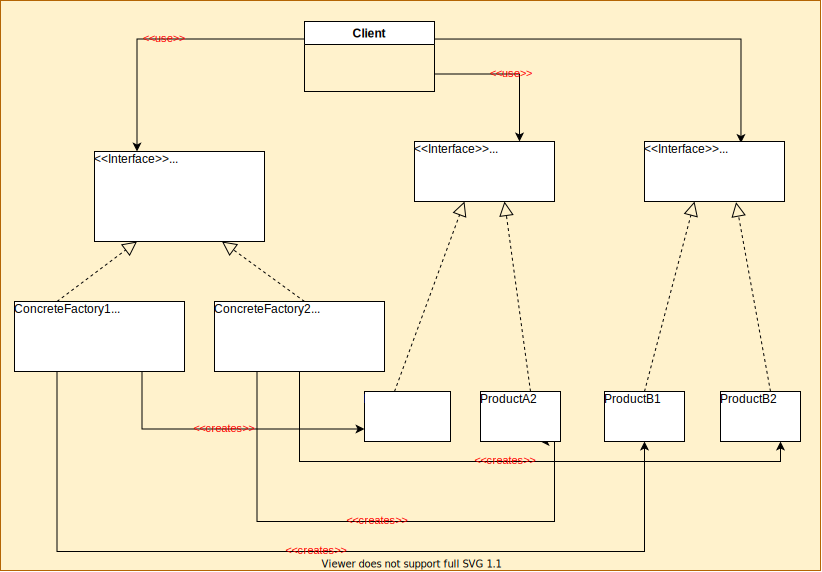

# Abstract Factory

## Definition

Abstract Factory design pattern is one of the creational patterns. 
Abstract Factory pattern is almost similar to Factory Pattern and is considered as another layer of abstraction over factory pattern. 
Abstract Factory patterns work around a super-factory which creates other factories.
Abstract factory pattern implementation provides us with a framework that allows us to create objects that follow a general pattern. 
So at runtime, the abstract factory is coupled with any desired concrete factory which can create objects of the desired type.

### Use cases

1. When we want to separate the logic for how objects are created, composed or represented (decouple). Client does not need to know how products are created.
2. When there are multiple families of products, i.e., there can be multiple implementations of the factory.
3. With the above two points, one example would be if the client only cares if the products are of certain types and not which of its subtypes. Thus, how the objects are created and from where would not matter.
4. When there is a constraint such that a group of related objects have to be used together.
5. When we want to provide a class library of products, but not reveal their underlying implementation. Instead we just provide an interface to each type of product.

### Pros: 
1. Reduced coupling and increased cohesion. Factory objects are responsible for the product creation logic. There is also greatly reduced coupling between the Client and concrete implementations of the factory and products
2.  Dependency Inversion is achieved as each class depends on the interface of the other participants instead of their underly implementation.
3. Open-Closed Principle (OCP) is fulfilled too, as new implementations of factories and products can easily be added by implementing the existing interface without breaking any of the code in the client

### Cons:
1. It is hard to add a new type of product. We do it by changing the interface of the Abstract Factory to support the creation of this new product, and also we need to change all implementations for each of the Concrete Factories.
2. Abstract Factory Pattern increases code complexity and amount of classes and interfaces

## General diagram of Abstract Factory 

## ComponentFactory - detailed