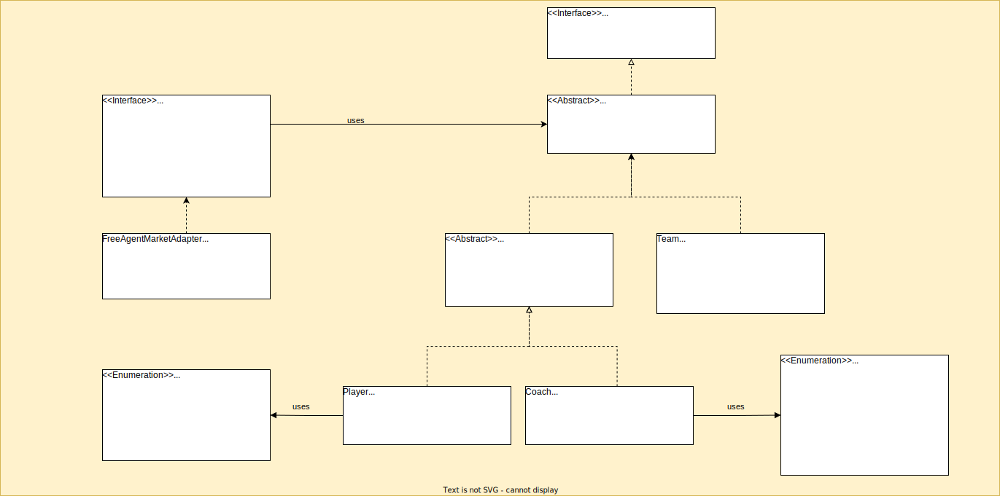

# Prototype

## Definition

The Prototype Design Pattern is a creational design pattern that allows you to create new objects by cloning existing
ones.
The idea is to create a **prototype** object and then create new objects by copying this prototype and then modifying it
as necessary.
This can be useful in situations where creating new objects from scratch is expensive, time-consuming, or difficult.
This allows you to create new objects that are similar to existing ones, but with slight variations.

## Java's Cloneable

The Cloneable interface is a marker interface, which means that it doesn't define any methods. Its purpose is simply to
indicate that the object implementing the interface can be cloned.

When an object is cloned in Java, the `clone()` method is used. However, the `clone()` is a protected method of the
Object class, which means that it can only be accessed by the object itself or by a subclass. To make an object
cloneable, you need to implement the Cloneable interface, which indicates to the JVM that the object can be cloned.

Bby default, the `clone()` method creates a [shallow copy](#shallow-copy) of the object, which means that the new object has
references to the same properties and sub-objects as the original object. If you need to create a deep copy of the
object, you would need to implement a custom clone() method that creates a [deep copy](#deep-copy) of the object, including all
sub-objects

### Code example

```
public abstract class Prototype<T> implements Cloneable {

    /**
     * Create <b>shallow copy</b> of this object.
     * <p>
     * It should be overridden, whenever special logic should be added.
     *
     * @return copy of this
     */
    public T copy() {
        try {
            return (T) super.clone();
        } catch (CloneNotSupportedException e) {
            throw new CloneNotSupportedRuntimeException("Cannot copy current object: " + this);
        }
    }
}
```

## Cloning methods

In the context of the Prototype Design Pattern, shallow copy and deep copy are used to create copies of the prototype
object. Based on object types we should choose proper strategy.

* `primitive`, with their `wrappers` and `immutable fields` -> [shallow copy](#shallow-copy)
* `mutable fields` -> [deep copy](#deep-copy)

### Shallow copy

A shallow copy creates a new object that is a copy of the prototype object, but with references to the same properties
and sub-objects.
This means that if any of the sub-objects are modified, they will be modified in both the original and the copy.
Shallow copies are useful when you need to create a copy of an object quickly and you don't need to modify the
sub-objects.

### Deep copy

Deep copy, on the other hand, creates a new object that is a complete copy of the prototype object, including all
sub-objects.
This means that if any of the sub-objects are modified, they will not be modified in the original or any other copies.
Deep copies are useful when you need to create a completely independent copy of an object.
We can achieve that with [copy constructors](#copy-constructors)
or [serialization and deserialization](#serialization-and-deserialization)

#### Copy constructors

A copy constructor is a constructor that creates a new object by copying the values of another object. To create a copy
constructor, you define a new constructor that takes an instance of the same class as its parameter. The copy
constructor then creates a new object and initializes its fields with the values from the parameter object.

```
public class Team extends Prototype<Team> {

...

    public Team(Team team) {
        this.name = team.getName();
        this.coach = team.getCoach().copy();
        this.players = team.getPlayers().stream().map(Player::copy).toList();
    }
...
}
```

#### Serialization and deserialization

**Serialization** is the process of converting an object into a stream of bytes, which can be stored in a file or
transmitted over a network. The opposite process of converting a stream of bytes back into an object is called
**deserialization**.

With some help
from [Apache Commons: SerializationUtils](https://commons.apache.org/proper/commons-lang/javadocs/api-release/org/apache/commons/lang3/SerializationUtils.html)

```
public class Team extends Prototype<Team> {

...

    public Team(Team team) {
        this.name = team.getName();
        this.coach = SerializationUtils.clone(team.getCoach());
        this.players = SerializationUtils.clone(team.getPlayers());
    }
...
}
```

## Class diagram of free agent market (sport analogy)

