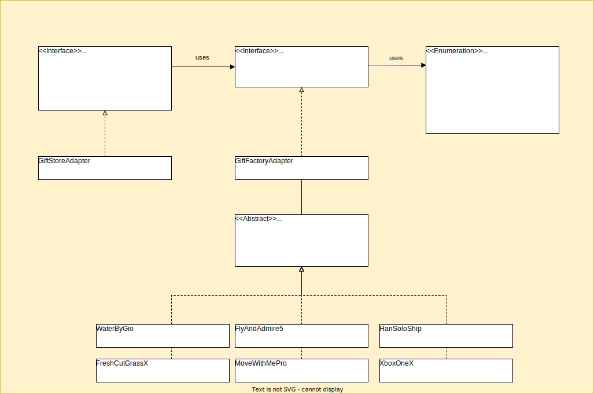

# Simple Factory

## Definition

The simple factory design pattern is a design pattern that is used to create objects without specifying the exact class of object that will be created. This is
done by creating a factory class that has a method for creating objects, and the class of object that is created is determined by the input to this method.

## Use cases

### Runtime creation
One use case for the simple factory design pattern is when you have a system that needs to work with objects of different classes, but the exact class of object
that will be used is not known until runtime. Using the simple factory design pattern, you can create a factory class that can create objects of the appropriate
class, based on input provided at runtime. This allows you to write code that is more flexible and easier to maintain, since you don't have to manually create
objects of each class that you want to use.

### Objects creation in one place
Another use case for the simple factory design pattern is when you want to centralize the creation of objects in your system. By using a factory class, you can
ensure that all objects in your system are created in the same way, and you can also easily change the way objects are created in the future if necessary,
without having to update the code in multiple places. This can make your code more maintainable and easier to understand.

## Class diagram of gift store

