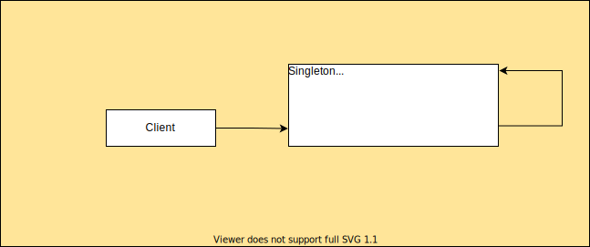

# Singleton

## Definition

In Java, the Singleton pattern is a design pattern that restricts the instantiation of a class to one object and provides global access to that instance throughout the application.
It ensures that a class has only one instance and provides a single point of access to that instance.

The Singleton pattern involves a class that has a private constructor, which prevents other classes from instantiating it directly. 
Instead, the class provides a static method that returns the sole instance of the class.
If the instance does not exist, the static method creates one, and if it already exists, it simply returns it.

## Use cases

### Configuration Settings
When you have a configuration file or settings that should be loaded only once and made available to the entire application,
you can use a Singleton to ensure that the settings are loaded and accessed only once.

### Logging
In a large application, logging can be a performance bottleneck if every class creates its own logger instance.
By using a Singleton logger instance, you can ensure that logging is centralized and optimized.

### Database Connections
When you have a single database connection that should be shared across the application,
you can use a Singleton to ensure that the connection is established and accessed only once.

### Cache
If you have an object that is expensive to create and that should be reused multiple times,
you can use a Singleton to ensure that only one instance of the object is created and that it is reused throughout the application.

### Thread pools
When you need to manage a pool of threads, you can use a Singleton to ensure that the pool is created only once and that all threads are managed centrally.

