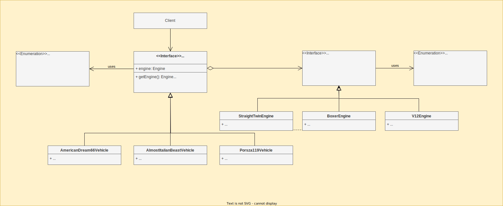

# Bridge

## Definition

The **Bridge** is a structural design pattern that separates an abstraction from its implementation, allowing the two to vary independently. It
decouples the abstraction from the implementation, enabling both to change independently.

This pattern promotes loose coupling by enabling the separation of the abstract and concrete aspects of a system, increasing flexibility and maintainability. It
also allows for multiple implementations of the same abstraction, simplifying component-based software development.

## Use Cases

The Bridge Design Pattern is commonly used in various applications, including:

- **Graphical User Interfaces (GUIs)**
    - Theme management: Abstract the rendering logic from the visual components, allowing for the use of different themes without modifying the core components.
    - Renderers: Implement different rendering engines for different platforms or devices.
- **Data Storage and Persistence**
    - Database abstraction: Abstract the database access from the data access logic, allowing for different database implementations.
    - File storage: Abstract the file storage mechanism from the data storage logic, enabling the use of different file formats or storage systems.
- **Network Components**
    - Protocol abstraction: Abstract the network protocol from the communication logic, allowing for the use of different network protocols (TCP, UDP) or
      message formats.
    - Client-server communication: Abstract the client-server interaction from the application logic, enabling the use of different network communication
      libraries or protocols.

## Implementation Details

- **Abstraction**
  - The abstraction defines the core functionalities and behaviors of the system, focusing on high-level concepts and operations.
  - It relies on the implementation to handle the actual low-level details and implementation-specific aspects.
  - The abstraction provides a consistent interface for interacting with different implementation types, allowing clients to work with the abstraction without knowing the specific implementation details.

- **Implementation**
  - The implementation defines the underlying mechanisms and code that carry out the low-level operations required by the abstraction.
  - It provides a common interface that is used by the abstraction to communicate with the implementation, regardless of the specific implementation type.
  - Concrete implementations provide platform-specific or application-specific adaptations of the implementation interface.

- **Concrete implementations**
  - Provide platform-specific or application-specific adaptations of the implementation interface.

- **Refined abstraction**
  - A refined abstraction extends the base abstraction to provide variations in the control logic or behaviors.
  - It still relies on the implementation object to handle the actual low-level work and interacts with it through the shared implementation interface.
  - Refined abstractions allow for different ways of utilizing the abstraction's core functionalities, tailored to specific needs or scenarios.

- **Client**
  - The client interacts with the abstraction to utilize its functionalities and behaviors.
  - It is responsible for creating an instance of the abstraction and linking it with the appropriate implementation object.
  - The client remains unaware of the specific implementation details, interacting with the abstraction through its consistent interface.

## Advantages and Disadvantages

### Advantages

- **Loose Coupling**:
  Separates the abstraction from its implementation, allowing them to evolve independently.

- **Flexibility**:
  Enables the use of different implementations without modifying the abstraction.

- **Encapsulation**:
  Isolates the implementation details, promoting cleaner code and easier maintenance.

- **Reusability**:
  Facilitates the reuse of both abstract classes and concrete implementations.

### Disadvantages

- **Increased complexity**: Introduces an additional layer of abstraction, which can make the code more complex.

- **Performance overhead**: Can incur some performance overhead due to the additional indirection.

## Class diagram of car dealership

## Conclusion

The Bridge Design Pattern is a powerful tool for separating concerns and promoting flexible and reusable software architectures. By decoupling the abstraction
from its implementation, it allows for independent evolution of the system and simplifies maintenance. However, it's essential to weigh the benefits against the
potential complexity introduced by the pattern.