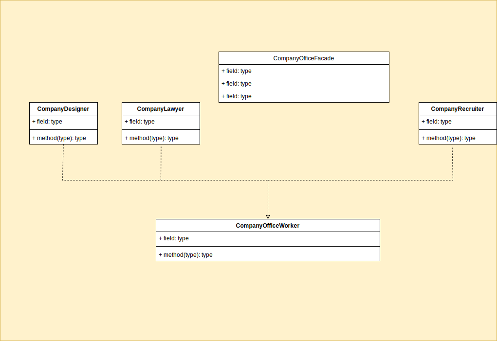

# Facade

## Definition

Facade is a structural design pattern that provides a simplified interface to a library, a framework, or any 
other complex set of classes.

## Use cases

### Simplifying Complex Subsystem Interactions
The Facade pattern is useful when dealing with a complex system consisting of multiple subsystems. By providing 
a unified interface, the Facade simplifies the interactions between the client and the subsystems. 

### Enhancing Code Readability and Maintainability
By encapsulating the complexities of subsystems, the Facade pattern improves code readability and maintainability. 
It hides the implementation details of the subsystems behind a single interface, making it easier for developers to 
understand and modify the codebase. 

### Creating a Simple API for External Systems
When integrating with external systems or APIs, the Facade pattern can be valuable. It allows you to create 
a simplified API that shields the client from the intricacies of the external system. 

## Class diagram of CompanyOffice

